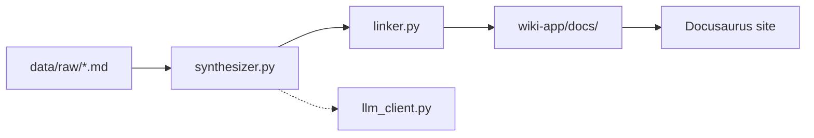

# LLM Wiki Project

Personal knowledge base using the **[Karpathy LLM Wiki pattern](https://gist.github.com/karpathy/442a6bf555914893e9891c11519de94f)** — raw junk data in, compiled markdown out, static site for browsing.

## Structure

```
llm-wiki-project/
├── data/
│   └── raw/                 # Junk / source files (you add here)
├── compiler/                # Python pipeline (LLM + heuristics)
│   ├── main.py              # Orchestrator
│   ├── llm_client.py        # OpenAI-compatible API
│   ├── synthesizer.py       # Summarize & categorize
│   └── linker.py            # Cross-link injection
└── wiki-app/                # Docusaurus static site
    ├── docs/                # Generated markdown output
    └── docusaurus.config.js
```

## Quick start

### 1. Add junk data

Drop `.md` files into `data/raw/` (subfolders like `articles/`, `notes/`, `transcripts/` are fine).

### 2. Compile wiki

```bash
cd compiler
python3 -m venv .venv
source .venv/bin/activate
pip install -r requirements.txt
python main.py --force
```

Without `OPENAI_API_KEY`, the compiler uses **heuristic mode** (regex extraction). With a key in `.env`, it uses the LLM for richer synthesis.

### 3. Browse the site

```bash
cd wiki-app
npm install
npm start
```

Open http://localhost:3000 — redirects to `/docs/index`.

## Pipeline flow



| Step | Module | Role |
|------|--------|------|
| Ingest | `main.py` | Discover raw files, run pipeline |
| Synthesize | `synthesizer.py` | Source summaries, entities, concepts |
| Link | `linker.py` | `[[wikilinks]]` → markdown links |
| Output | `main.py` | Write Docusaurus frontmatter to `wiki-app/docs/` |

## Sample data

Fictional **Aurora Labs** startup junk data is pre-loaded in `data/raw/`:

- `notes/2026-05-01-kickoff-notes.md`
- `articles/2026-05-15-product-spec-draft.md`
- `articles/2026-05-20-competitor-teardown-blog.md`
- `transcripts/2026-05-28-weekly-sync.md`

## Configuration

Copy `.env.example` → `.env`:

```env
OPENAI_API_KEY=sk-...
OPENAI_MODEL=gpt-4o-mini
```

## Cursor workflows

See `AGENTS.md` for ingest / query / lint conventions when using Cursor as the wiki maintainer alongside the Python compiler.

See `PROMPTS.md` for starter Cursor prompts.
