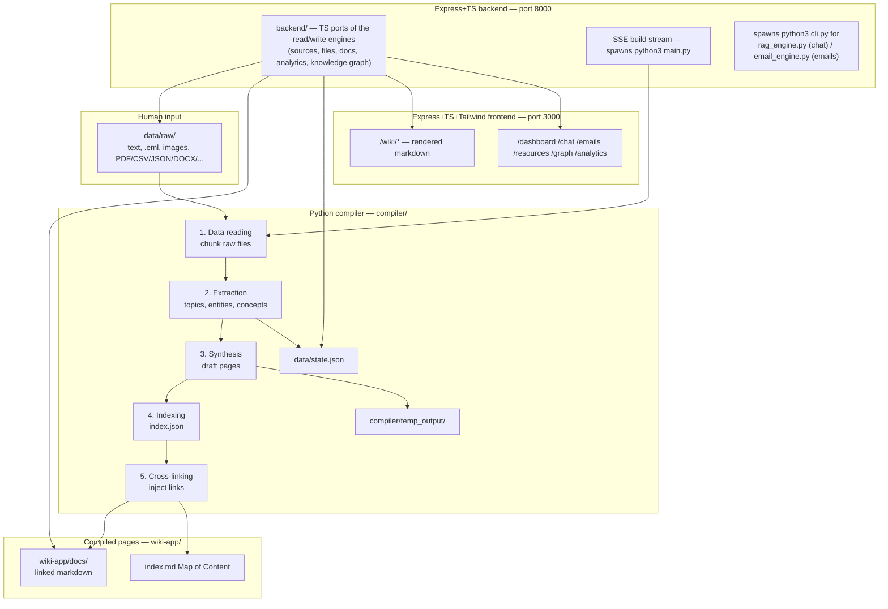

# LLM Wiki

Personal knowledge base built on the **[Karpathy LLM Wiki pattern](https://gist.github.com/karpathy/442a6bf555914893e9891c11519de94f)**: drop messy raw notes into `data/raw/`, run a Python compiler pipeline, and browse the result through an Express + TypeScript + Tailwind app with a single unified nav (wiki pages and dashboards in one product, not a docs site with a dashboard bolted on).

> **Stack note:** the frontend/backend used to be Docusaurus + a React
> dashboard; that's been replaced by `backend/` (Express+TS API) and
> `frontend/` (Express+TS+Tailwind, server-rendered, no client framework).
> The Python compiler pipeline itself, and retrieval/chat (`rag_engine.py`)
> and email parsing (`email_engine.py`), are unchanged. Some sections below
> still describe the old Docusaurus/React stack in deep-dive code samples;
> where they conflict with [documentation/11-wiki-app-and-dashboards.md](./documentation/11-wiki-app-and-dashboards.md), that doc is current.

The sample domain is fictional **Aurora Labs** (open IoT sensors), cross-linked with **TeaBuddy** (BLE tea timers), **Nova Health** (wearables), and **GreenGrid Energy** (home energy mesh). Replace these with your own topic when ready.

---

## Table of contents

1. [Project overview](#project-overview)
2. [Tech stack](#tech-stack)
3. [Repository structure](#repository-structure)
4. [Prerequisites](#prerequisites)
5. [Quick start](#quick-start)
6. [Compiler pipeline](#compiler-pipeline)
7. [API server](#api-server)
8. [Wiki app and dashboards](#wiki-app-and-dashboards)
9. [Dummy data generation](#dummy-data-generation)
10. [Data layout](#data-layout)
11. [Configuration](#configuration)
12. [CI/CD](#cicd)
13. [Development workflows](#development-workflows)
14. [Troubleshooting](#troubleshooting)
15. [Contributing and agent workflows](#contributing-and-agent-workflows)

---

## Project overview

LLM Wiki turns unstructured raw sources — meeting notes, `.eml` email threads, forum scrapes, half-finished specs, images, and PDF/CSV/JSON/DOCX/XLSX/PPTX/ZIP attachments — into a linked markdown wiki suitable for Docusaurus. The compiler uses an **OpenAI-compatible API** for extraction, synthesis, cross-linking, and image captioning (`OPENAI_API_KEY` required). See [documentation/19-multimedia-email-and-trust.md](./documentation/19-multimedia-email-and-trust.md) for how non-text sources and source-trust/citation tracking work.

Three dedicated "engine" modules sit on top of the base pipeline, each with its own dashboard page and unit tests, independent of one another: an **email knowledge engine** (browse ingested `.eml` threads on their own, see [documentation/20-email-resources-and-chat-engines.md](./documentation/20-email-resources-and-chat-engines.md)), a **resources engine** (every cited source deduped across pages, reusable independent of which page cites it), and a **RAG chat engine** (ask questions over the compiled wiki and get cited answers — works with or without an LLM configured). The dashboard defaults to a minimal, light-only theme.

### Architecture



| Layer | Path | Owner | Description |
|-------|------|-------|-------------|
| Raw sources | `data/raw/` | Human | Source-of-truth junk data. Never edit via automated agents without explicit intent. |
| Compiler | `compiler/` | Python pipeline | Reads raw files, extracts structure, writes drafts, links pages. |
| Engines | `compiler/email_engine.py`, `resources_engine.py`, `rag_engine.py` | Python, pure functions | Email browsing, deduped cross-page resources, and RAG chat — each independent, unit-tested without a running server. |
| Wiki output | `wiki-app/docs/` | Generated | Docusaurus-ready markdown with YAML front matter. |
| Static site | `wiki-app/` | React/Docusaurus | Browsing UI, chat, email/resource explorers, graphs, analytics, live compile dashboard. Light/white theme only. |
| Agent schema | `AGENTS.md` | Human + LLM | Workflows for compile, ingest, query, and lint. |

---

## Tech stack

| Component | Technology | Role |
|-----------|------------|------|
| Compiler | Python 3.12+ | Orchestration in `main.py`; modules for synthesis, linking, MOC, analytics |
| LLM client | OpenAI SDK + SQLite cache | Extraction, synthesis, link injection, and chat retrieval (required for extraction) |
| Backend API | Express + TypeScript | REST endpoints and SSE build streaming on port **8000**; ports the read/write engines to TS, spawns `python3` for the compile and for chat/email (`compiler/cli.py`) |
| Frontend | Express + TypeScript + EJS | Server-rendered wiki pages and dashboards (`/wiki`, `/dashboard`, `/chat`, `/emails`, `/resources`, `/analytics`, `/graph`) — one nav, no client framework, port **3000** |
| Styling | Tailwind CSS 3 + `@tailwindcss/typography` | Dashboard UI + rendered-markdown `prose` styling |
| Client interactivity | Hand-written TypeScript, bundled per-page with esbuild | No React/framework — `dashboard.ts`, `chat.ts`, etc. |
| Build UX | Server-Sent Events | Live compiler log stream from `/api/build/stream` |
| CI | GitHub Actions | Compile + build + GitHub Pages deploy |

---

## Repository structure

```
wiki/
├── README.md                    # This file
├── AGENTS.md                    # Agent/human workflow schema
├── PROMPTS.md                   # Example Cursor prompts
├── build_wiki.sh                # One-command: compile + build backend + build frontend
├── .env.example                 # API key template (copy to .env)
├── .github/workflows/
│   └── wiki-build.yml           # CI: compile → build → GitHub Pages
│
├── data/
│   ├── raw/                     # Raw sources: text, .eml, images, files — you add here
│   ├── state.json               # Incremental compiler state (MD5 hashes, extractions)
│   ├── link_overrides.json      # Manual knowledge-graph connection rules
│   ├── source_trust.json        # Per-source trust level rules (trust.py)
│   └── .llm-cache.sqlite        # LLM response cache (created when using API)
│
├── compiler/
│   ├── main.py                  # Full 5-step pipeline orchestrator
│   ├── synthesizer.py           # Chunking, extraction, LLM synthesis
│   ├── text_chunking.py         # Shared paragraph-chunking helper
│   ├── media_ingest.py          # Images + file attachments → chunks
│   ├── email_ingest.py          # .eml parsing → chunks
│   ├── trust.py                 # Source trust levels + References & Trust section
│   ├── doc_utils.py             # Shared frontmatter/topic-lookup helpers (ported to backend/src/lib/docUtils.ts)
│   ├── email_engine.py          # Email knowledge engine, called via cli.py (backs /emails)
│   ├── resources_engine.py      # Deduped, cross-page resources engine (ported to backend/src/lib/resourcesEngine.ts)
│   ├── rag_engine.py            # RAG chat engine, called via cli.py (backs /chat)
│   ├── linker.py                # Topic index + cross-link injection
│   ├── moc_generator.py         # Hierarchical index.md (Map of Content)
│   ├── cli.py                   # JSON-in/JSON-out subprocess bridge for the Node backend (chat, emails)
│   ├── analytics.py             # Metrics, tag index, dead-link audit (ported to backend/src/lib/analytics.ts)
│   ├── llm_client.py            # OpenAI client, retries, SQLite cache, vision captioning
│   ├── link_overrides.py        # Knowledge graph overrides (ported to backend/src/lib/linkOverrides.ts)
│   ├── sources_registry.py      # Source-folder symlink mirroring (ported to backend/src/lib/sourcesRegistry.ts)
│   ├── raw_folders.py           # data/raw/ folder create/delete/move (ported to backend/src/lib/rawFolders.ts)
│   ├── temp_output/             # Draft pages + index.json (pre-link)
│   ├── tests/                   # pytest suite (pure logic + fake-LLM pipeline tests)
│   ├── scripts/dev/generate_dummy_data.py          # Dispatcher CLI for the generators below
│   ├── scripts/dev/generate_junk_data.py           # 10 Aurora Labs seed files
│   ├── scripts/dev/generate_bulk_dummy_data.py     # [SAMPLE] + procedural bulk generators
│   ├── scripts/dev/generate_varied_dummy_data.py   # Large multi-type varied files
│   ├── scripts/dev/generate_extended_dummy_data.py # Wave-2 curated sample set
│   ├── scripts/dev/keep_aurora_raw.py              # Archive non-Aurora raw files
│   └── requirements.txt
│
├── backend/                     # Express + TypeScript API server
│   ├── src/
│   │   ├── index.ts             # App entrypoint, port 8000
│   │   ├── routes/index.ts      # All /api/* routes
│   │   └── lib/                 # TS ports of the compiler's read/write engines + pythonBridge.ts
│   ├── Dockerfile                # Node + Python (needs both — see documentation/11)
│   └── package.json
│
├── frontend/                    # Express + TypeScript + Tailwind, server-rendered
│   ├── src/
│   │   ├── index.ts             # App entrypoint, port 3000
│   │   ├── routes/               # wiki.ts, dashboard.ts, simple.ts (chat/emails/resources/graph/analytics)
│   │   ├── views/                # EJS templates, partials/head.ejs + foot.ejs = the app shell
│   │   ├── client/                # Per-page TypeScript, bundled with esbuild (no framework)
│   │   └── markdown.ts           # marked + internal-link rewriting + heading-id slugging
│   ├── tailwind.config.js
│   ├── Dockerfile
│   └── package.json
│
└── wiki-app/                    # Now just the compiler's output directory (no app here anymore)
    ├── docs/                    # Compiler output (generated markdown), read by backend/
    └── static/media/            # Ingested images/attachments (content-hash deduped)
```

---

## Prerequisites

| Requirement | Version | Notes |
|-------------|---------|-------|
| **Python** | 3.12+ recommended | Used by compiler and API server |
| **Node.js** | ≥ 18 | Docusaurus dev server and build |
| **npm** | Comes with Node | Install wiki-app dependencies |
| **Git** | Any recent | Clone and CI deploy |

Required:

- **OpenAI API key** (or compatible endpoint) — the compiler is LLM-only; extraction, synthesis, linking, and image captioning all need it

Optional:

- **GitHub Pages** enabled on the repo for automated deploy from `main`

---

## Quick start

**Docker (both services, one command):**

```bash
cp .env.example .env   # add an API key, or skip and use the local LLM below
docker compose up --build
```

Backend at http://localhost:8000, frontend at http://localhost:3000.
For a local LLM (Gemma, run in-process by llama.cpp — no Ollama) instead of a paid API key, use
`docker compose --profile local-llm up --build` — see
[documentation/33-docker-and-local-llm.md](./documentation/33-docker-and-local-llm.md).
The manual (non-Docker) setup below is equivalent and useful for local
development without containers.

### 1. Clone and configure

```bash
git clone <your-repo-url> wiki
cd wiki
cp .env.example .env
# Edit .env and set OPENAI_API_KEY — required, the compiler is LLM-only
```

### 2. Python compiler (virtualenv)

```bash
cd compiler
python3 -m venv .venv
source .venv/bin/activate   # Windows: .venv\Scripts\activate
pip install -r requirements.txt
python main.py --force      # First full compile
```

Set `OPENAI_API_KEY` in `.env` before compiling. Without a key, `python main.py` exits with an error.

### 3. Start the backend (Express + TypeScript API)

In a second terminal:

```bash
cd backend
npm install
npm run dev:server
```

API base URL: **http://localhost:8000**. Also spawns `python3` for
build/chat/email requests — see
[documentation/11-wiki-app-and-dashboards.md](./documentation/11-wiki-app-and-dashboards.md).

### 4. Start the frontend (Express + TypeScript + Tailwind)

In a third terminal:

```bash
cd frontend
npm install
npm run dev:server
```

In two more terminals (only needed while actively editing styles/client
scripts):

```bash
cd frontend && npm run dev:css      # Tailwind watch
cd frontend && npm run dev:client   # esbuild watch (client bundles)
```

Site: **http://localhost:3000**

Open **Dashboard** at http://localhost:3000/dashboard to browse raw files, trigger live compiles, and manage source folders. From there, **Chat** (`/chat`) answers questions over the compiled wiki, **Emails** (`/emails`) browses ingested `.eml` threads, and **Resources** (`/resources`) lists every cited source deduped across pages.

### 5. One-command production build

From the repo root:

```bash
chmod +x build_wiki.sh
./build_wiki.sh                  # LLM mode if OPENAI_API_KEY is set
./build_wiki.sh --force          # Reprocess all raw files (ignore state.json)
```

Output: `backend/dist/` + `frontend/dist/`/`frontend/dist-static/`. Run:

```bash
cd backend && npm start    # terminal 1
cd frontend && npm start   # terminal 2
```

---

## Compiler pipeline

Entry point: `compiler/main.py`. The pipeline runs five sequential steps, then generates a Map of Content.

| Step | Name | Module | Action |
|------|------|--------|--------|
| 1 | **Data reading** | `synthesizer.py` | Recursively scan `data/raw/` for `.txt` and `.md`; split into ~2000-char paragraph chunks |
| 2 | **Extraction** | `synthesizer.py` | Per chunk: extract topics, entities, concepts via LLM. Skip unchanged files via MD5 in `data/state.json` |
| 3 | **Synthesis** | `synthesizer.py` | Group chunks by topic; write draft wiki pages to `compiler/temp_output/` |
| 4 | **Indexing** | `linker.py` | Build/update `compiler/temp_output/index.json` mapping topic titles → filenames |
| 5 | **Cross-linking** | `linker.py` | Inject internal markdown links; export final pages to `wiki-app/docs/` |
| + | **Map of Content** | `moc_generator.py` | Generate hierarchical `wiki-app/docs/index.md` from tags and page types |

### LLM pipeline

The compiler requires a valid `OPENAI_API_KEY` (or compatible endpoint via `OPENAI_BASE_URL`). It uses chat completions for extraction, synthesis, and link injection. Responses are cached in `data/.llm-cache.sqlite`.

### CLI flags

```bash
python main.py                 # Incremental run (only changed raw files)
python main.py --force         # Reprocess every file regardless of MD5
```

Incremental behavior:

- **Step 2** compares file MD5 hashes against `data/state.json`
- **Step 3** regenerates only topic pages affected by changed/deleted sources
- **Step 5** re-links only dirty pages unless `--force` is set

Rich progress output uses the `rich` library (tables, spinners, step banners).

### Generated page format

Each exported page includes Docusaurus YAML front matter:

```yaml
---
id: unique-id
title: Page Title
sidebar_label: Short label
slug: /path/to/page
tags:
  - tag
page_type: source | entity | concept | comparison | synthesis
---
```

Wikilinks in drafts use `[[slug/path|Label]]` syntax; `linker.py` converts them to standard markdown links.

---

## API server

Start with `compiler/run_server.sh` (creates venv, installs deps, runs `server.py` on **port 8000** with hot reload).

Alternatively:

```bash
cd compiler
source .venv/bin/activate
python server.py
# or: uvicorn server:app --host 0.0.0.0 --port 8000 --reload
```

CORS is enabled for `http://localhost:3000` and `http://127.0.0.1:3000`.

### Endpoints

| Method | Path | Description |
|--------|------|-------------|
| `GET` | `/api/health` | Health check `{ "status": "ok" }` |
| `GET` | `/api/raw-files` | List all raw files with Processed/Unprocessed status |
| `GET` | `/api/raw-files/{path}` | Raw file content + extracted metadata + synthesized pages |
| `GET` | `/api/docs` | List generated markdown pages |
| `GET` | `/api/docs/{path}` | Single page body, front matter, and outbound links |
| `GET` | `/api/state` | Contents of `data/state.json` |
| `GET` | `/api/build/status` | `{ "running": true/false }` |
| `GET` | `/api/build/stream` | **SSE** — run compiler; query param: `force` |
| `GET` | `/api/knowledge-graph` | Topics, detected links, manual overrides, effective graph |
| `PUT` | `/api/knowledge-graph/overrides` | Save connection rules to `data/link_overrides.json` |
| `GET` | `/api/analytics` | Summary metrics, tag index, dead-link audit |
| `GET` | `/api/analytics/tags/{tag}` | Raw chunks and pages for a tag |
| `GET` | `/api/emails` | List ingested `.eml` sources with parsed headers, status, trust |
| `GET` | `/api/emails/{path}` | Full email body, attachments, and the wiki pages it fed |
| `GET` | `/api/resources` | Every cited source, deduped, with citing pages (filter: `q`, `source_type`, `trust`) |
| `GET` | `/api/resources/{path}` | One resource's citing pages + raw content preview |
| `POST` | `/api/chat` | RAG chat over the compiled wiki — `{"message", "history"}` in, `{"answer", "sources", "mode"}` out |
| `GET` | `/api/chat/status` | Corpus size and whether an LLM is configured for chat |
| `GET` | `/api/review-report` | Contents of `compiler/review_report.txt` if present |

SSE events from `/api/build/stream`:

```json
{ "type": "start", "message": "...", "command": "..." }
{ "type": "log", "message": "..." }
{ "type": "done", "code": 0, "success": true, "message": "Build complete." }
```

The frontend client lives in `wiki-app/src/utils/wikiApi.js`.

---

## Wiki app and dashboards

Docusaurus serves compiled docs at `/docs/…`. Custom React pages (Tailwind-styled) connect to the API:

| Route | Page | Purpose |
|-------|------|---------|
| `/workspace` | **Dashboard** | Browse raw vs compiled files; live compile via SSE; pipeline metrics |
| `/chat` | **Chat** | RAG chat over the compiled wiki — cited, grounded answers (`compiler/rag_engine.py`) |
| `/emails` | **Emails** | Email knowledge engine — browse/search ingested `.eml` threads and what they fed into the wiki |
| `/resources` | **Resources** | Every cited source, deduped, browsable independent of which page cites it |
| `/analytics` | **Analytics & Audit** | Tag explorer, dead-link report, compiler metrics |
| `/graph` | **Topic Graph** | Force-directed graph from `index.json` cross-links |
| `/knowledge-graph` | **Knowledge Graph Explorer** | Detected + manual connections; edit overrides saved to `data/link_overrides.json` |

Navbar links are configured in `wiki-app/docusaurus.config.js`.

Key components:

- `DataWorkspace` — raw file browser, doc preview, build trigger
- `LiveBuild` — SSE log viewer for `/api/build/stream`
- `WikiGraph` — topic graph visualization
- `KnowledgeGraphExplorer` — connection editor with require/block rules
- `AnalyticsAudit` — metrics and tag drill-down
- Shared UI: `PageShell`, `PageHeader`, `DashboardNav`, `Button`

**Important:** Dashboard pages require the API server running on port 8000. The static docs under `/docs` work without the API.

---

## Dummy data generation

Four Python scripts populate fictional test data for pipeline stress-testing. All write under `data/raw/` (or subdirectories). Files are safe to delete; regenerate with `--overwrite`.

### Markers and naming

| Marker | Meaning | Typical location |
|--------|---------|------------------|
| `[SAMPLE]` | Curated narrative samples (Aurora + TeaBuddy storylines) | `data/raw/samples/` |
| `[DUMMY TEST DATA]` | Procedural or labeled test content | Body text prefix |
| `[DUMMY-TEST-DATA]` | Procedural filename prefix | `bulk/`, `varied-samples/`, etc. |

### Fictional domains

| Company | Slug | Domain |
|---------|------|--------|
| **Aurora Labs** | `aurora` | IoT mesh sensors (Nova Widget, MeshSync) |
| **TeaBuddy** | `teabuddy` | BLE smart tea puck |
| **Nova Health** | `nova-health` | Clinical wearables (PulsePatch) |
| **GreenGrid Energy** | `greengrid` | Home energy mesh (GreenGrid Hub) |

Recurring characters: Mira Chen, Jonah Park, Sam Rivera, Alex Kim, Jamie Lo, and others. Intentional **contradictions** (battery life, read interval, herbal preset timing) exercise cross-linking and audit tools.

---

### `scripts/dev/generate_junk_data.py` — seed Aurora Labs junk (10 files)

Original Karpathy-style messy notes: standups, grocery lists, forum scrapes, voice memos.

```bash
cd compiler
python scripts/dev/generate_junk_data.py
python scripts/dev/generate_junk_data.py --overwrite
python scripts/dev/generate_junk_data.py --output ../data/raw
```

**Output:** `data/raw/notes/`, `transcripts/`, `articles/`, `ideas/` (10 predefined files).

---

### `scripts/dev/generate_bulk_dummy_data.py` — bulk [SAMPLE] + procedural files

Unified CLI for three generation modes.

```bash
cd compiler

# Default: 20 [SAMPLE] files in samples/ + 85 procedural [DUMMY TEST DATA] files
python scripts/dev/generate_bulk_dummy_data.py

# Only legacy [SAMPLE] narrative set (20 files)
python scripts/dev/generate_bulk_dummy_data.py --samples-only

# Only procedural [DUMMY TEST DATA] files (default count: 85)
python scripts/dev/generate_bulk_dummy_data.py --dummy-only

# Procedural count and sequence offset
python scripts/dev/generate_bulk_dummy_data.py --dummy-only --count 200 --start-seq 100

# Write procedural files only under one subdir
python scripts/dev/generate_bulk_dummy_data.py --dummy-only --only-subdir bulk --count 50

# Large varied files (delegates to scripts/dev/generate_varied_dummy_data.py)
python scripts/dev/generate_bulk_dummy_data.py --varied-only
python scripts/dev/generate_bulk_dummy_data.py --varied-only --count 50 --min-bytes 5000 --max-bytes 20000

# Replace existing files
python scripts/dev/generate_bulk_dummy_data.py --overwrite

# Custom output root
python scripts/dev/generate_bulk_dummy_data.py --output /path/to/data/raw
```

**Flags summary:**

| Flag | Default | Description |
|------|---------|-------------|
| `--overwrite` | off | Replace existing files |
| `--output PATH` | `data/raw/` | Output root |
| `--count N` | 85 (procedural) / 35 (varied) | Number of files to generate |
| `--start-seq N` | 1 | First sequence number for procedural filenames |
| `--samples-only` | off | Only `[SAMPLE]` files under `samples/` |
| `--dummy-only` | off | Only procedural `[DUMMY TEST DATA]` files |
| `--varied-only` | off | Only large varied files (see below) |
| `--only-subdir DIR` | all | Restrict procedural output to one subdir (`bulk`, `notes`, …) |
| `--min-bytes` | 3000 | Min size for `--varied-only` |
| `--max-bytes` | 12000 | Max size for `--varied-only` |

**Procedural subdirs:** `bulk/`, `dummy-test/`, `notes/`, `transcripts/`, `specs/`, `emails/`, `samples/bulk/`

**Doc kinds (procedural):** meeting notes, spec drafts, email threads, research dumps, retros, support tickets, partner memos, forum scrapes.

---

### `scripts/dev/generate_varied_dummy_data.py` — large multi-type files (10 doc types)

Generates **35 files by default** (3–15 KB each) under `data/raw/varied-samples/{type}/`.

**Document types:**

| Type slug | Extension | Description |
|-----------|-----------|-------------|
| `transcript` | `.txt` | Meeting transcript fragments |
| `prd` | `.md` | Product requirements documents |
| `email` | `.txt` | Email thread exports |
| `research` | `.md` | Competitive/technical research |
| `adr` | `.md` | Architecture decision records |
| `changelog` | `.md` | Firmware/release changelogs |
| `faq` | `.md` | Support FAQ pages |
| `chat-log` | `.txt` | Slack-style chat exports |
| `interview` | `.txt` | User interview transcripts |
| `spec` | `.md` | Hardware/firmware spec fragments |

```bash
cd compiler
python scripts/dev/generate_varied_dummy_data.py
python scripts/dev/generate_varied_dummy_data.py --count 50 --overwrite
python scripts/dev/generate_varied_dummy_data.py --min-bytes 8000 --max-bytes 25000
python scripts/dev/generate_varied_dummy_data.py --clean --overwrite   # wipe varied-samples/ first
python scripts/dev/generate_varied_dummy_data.py --stats-only          # print size stats without writing
```

Also invokable via `scripts/dev/generate_bulk_dummy_data.py --varied-only`.

---

### `scripts/dev/generate_extended_dummy_data.py` — wave-2 curated set (42 files)

Hand-authored wave-2 content: firmware changelogs, QA matrices, investor drafts, MQTT schema, legal snippets, social scrapes, and more `[SAMPLE]` files across new categories (`emails/`, `research/`, `specs/`, `legal/`, `social/`).

```bash
cd compiler
python scripts/dev/generate_extended_dummy_data.py
python scripts/dev/generate_extended_dummy_data.py --overwrite
python scripts/dev/generate_extended_dummy_data.py --output ../data/raw
```

**Output locations:**

- `data/raw/dummy-test/` — operational docs (changelog, QA matrix, slack dump, …)
- `data/raw/samples/notes/`, `articles/`, `transcripts/`, `ideas/`, `support/`, `forums/`, `emails/`, `research/`, `specs/`, `legal/`, `social/`

---

### Recommended generation workflow

```bash
# Minimal seed data for first compile
python compiler/scripts/dev/generate_junk_data.py

# Rich narrative + bulk procedural data
python compiler/scripts/dev/generate_bulk_dummy_data.py --overwrite

# Wave-2 curated samples
python compiler/scripts/dev/generate_extended_dummy_data.py --overwrite

# Large files for chunk/linker stress tests
python compiler/scripts/dev/generate_varied_dummy_data.py --overwrite

# Full recompile
cd compiler && python main.py --force
```

---

## Data layout

```
data/
├── raw/                         # All compiler input (text, .eml, images, files — recursive)
│   ├── notes/                   # Standups, scribbles (seed + generated)
│   ├── transcripts/             # Meeting/support transcripts
│   ├── articles/                # Spec fragments, blog scrapes
│   ├── ideas/                   # Brainstorms, backlogs
│   ├── emails/                  # Email threads
│   ├── specs/                   # Product/hardware specs
│   ├── dummy-test/              # Labeled [DUMMY TEST DATA] ops docs
│   ├── bulk/                    # Procedural bulk generator output
│   ├── samples/                 # [SAMPLE] curated narrative files
│   │   ├── notes/, articles/, … # Organized sample categories
│   │   └── bulk/                # Nested bulk samples
│   └── varied-samples/          # Large multi-type test files
│       ├── transcript/, prd/, email/, …
│       └── (one subdir per doc type)
│
├── state.json                   # Per-file MD5, chunk extractions, run history
├── link_overrides.json          # Manual knowledge-graph connections (version 1)
└── .llm-cache.sqlite            # LLM response cache (optional)
```

```
compiler/temp_output/            # Intermediate drafts (not served directly)
├── *.md                         # Unlinked draft pages
└── index.json                   # Topic title → filename map

wiki-app/docs/                   # Final linked markdown (Docusaurus docs/)
├── index.md                     # Map of Content (auto-generated)
├── entities/                    # Entity pages (when categorized)
├── concepts/
├── sources/
└── *.md                         # Flat topic pages
```

---

## Configuration

### Environment variables (`.env` at repo root)

Copy `.env.example`:

```env
OPENAI_API_KEY=sk-...
OPENAI_BASE_URL=https://api.openai.com/v1
OPENAI_MODEL=gpt-4o-mini
```

| Variable | Required | Description |
|----------|----------|-------------|
| `OPENAI_API_KEY` | **Yes** | OpenAI-compatible API key for the compiler |
| `OPENAI_BASE_URL` | No | OpenAI-compatible API base URL |
| `OPENAI_MODEL` | No | Model name (default `gpt-4o-mini`) |

The compiler loads `.env` from the repo root via `python-dotenv` in `llm_client.py`.

### Docusaurus (`wiki-app/docusaurus.config.js`)

```javascript
customFields: {
  wikiApiUrl: process.env.WIKI_API_URL || 'http://localhost:8000',
},
```

Set `WIKI_API_URL` when the API runs on a different host (e.g. staging). GitHub Pages builds use `GITHUB_PAGES`, `GITHUB_ORG`, and `GITHUB_REPO` env vars for `baseUrl`.

### Link overrides (`data/link_overrides.json`)

Manual knowledge-graph rules persisted across compiles:

```json
{
  "version": 1,
  "updated_at": "2026-05-31T19:33:29.220519+00:00",
  "connections": []
}
```

Edit via the Knowledge Graph Explorer UI or PUT `/api/knowledge-graph/overrides`. The linker applies `require` / `block` rules on the next pipeline run.

---

## CI/CD

Workflow: `.github/workflows/wiki-build.yml`

**Trigger:** push to `main`

**Build job:**

1. Checkout
2. Python 3.12 — `pip install -r compiler/requirements.txt`
3. `python compiler/main.py` (requires `OPENAI_API_KEY` repo secret)
4. Node 20 — `npm ci` in `wiki-app/`
5. `npm run build` with `GITHUB_PAGES=true`
6. Upload `wiki-app/build` as Pages artifact

**Deploy job:** GitHub Pages via `actions/deploy-pages@v4`

Enable **GitHub Pages** (source: GitHub Actions) in repository settings. Site URL pattern: `https://<org>.github.io/<repo>/`.

---

## Development workflows

See **AGENTS.md** for the canonical agent/human schema. Summary:

### Compile

```bash
cd compiler && python main.py --force
cd ../wiki-app && npm start
```

### Ingest (Cursor / agent)

When adding new raw material:

1. Add file under `data/raw/` (humans own this directory)
2. Run `python main.py --force` or manually refine `wiki-app/docs/`
3. Ensure cross-links between entity, concept, and source pages
4. Update `wiki-app/docs/index.md` if needed; add a log entry in `wiki-app/docs/log.md` if used

### Query

1. Read `wiki-app/docs/index.md` first
2. Drill into `docs/entities/`, `docs/concepts/`, etc.
3. Cite pages as `/docs/path/to/page`

### Lint

Check for contradictions, orphan pages, missing index entries, and broken wikilinks. The Analytics dashboard surfaces dead links via `/api/analytics`.

Example Cursor prompts: **PROMPTS.md**.

---

## Troubleshooting

### Python virtualenv / imports

```bash
cd compiler
python3 -m venv .venv
source .venv/bin/activate
pip install -r requirements.txt
```

Run all compiler commands from `compiler/` with the venv activated, or use `build_wiki.sh` / `run_server.sh` which manage the venv automatically.

### No raw files found

```
No raw files found under data/raw/
```

Ensure at least one `.txt` or `.md` file exists under `data/raw/`. Run `python scripts/dev/generate_junk_data.py` for seed data.

### YAML front matter errors

Generated pages use quoted strings for titles containing special characters. If manual edits break front matter, run `compiler/fix_frontmatter.py` or recompile with `--force`.

### Dashboard: "Could not reach the wiki API"

Start the API server:

```bash
cd compiler && ./run_server.sh
```

Verify http://localhost:8000/api/health returns `{"status":"ok"}`. Check `wikiApiUrl` in `docusaurus.config.js` matches.

### `clsx` module not found

Dashboard pages import `clsx`. Install wiki-app dependencies:

```bash
cd wiki-app && npm install
```

### `npm start` fails or port in use

```bash
cd wiki-app
npm run clear    # Clear Docusaurus cache
npm install
npm start        # Default port 3000
```

Kill any process on port 3000 if needed.

### Build already running (409)

Only one SSE compile can run at a time. Wait for the current build to finish or restart the API server.

### Slow compiles with large `data/raw/`

- Use incremental runs (default, no `--force`) during development
- Procedural bulk data can produce 1000+ files; expect longer compile times
- Use incremental runs (default, no `--force`) during development to reduce API calls

### GitHub Pages broken links

Production `baseUrl` is `/<repo>/`. Local dev uses `/`. Broken link warnings in build logs are often path-prefix related; check `docusaurus.config.js` `baseUrl` logic.

---

## Contributing and agent workflows

- **AGENTS.md** — architecture table, compile/ingest/query/lint workflows, page format spec
- **PROMPTS.md** — starter Cursor prompts for orient, compile, ingest, and lint tasks
- Raw files in `data/raw/` are human-owned; agents should not modify them unless explicitly ingesting new content
- Generated output lives in `wiki-app/docs/` and `compiler/temp_output/`
- Do not commit `.env`, `.llm-cache.sqlite`, or local venvs

Replace the Aurora Labs sample domain with your own topic by clearing `data/raw/`, adding your sources, and running `python main.py --force`.

---

## License and attribution

Built on the [Karpathy LLM Wiki pattern](https://gist.github.com/karpathy/442a6bf555914893e9891c11519de94f). Sample company names and characters are fictional.
