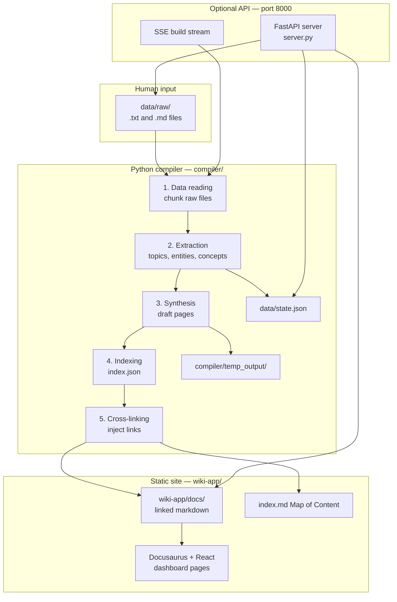

# 03 — Architecture

## System diagram



## Layer table

| Layer | Path | Owner | Mutable by agents? |
|-------|------|-------|-------------------|
| Raw sources | `data/raw/` | Human | Read-only unless ingesting |
| Compiler state | `data/state.json` | Compiler | No (auto-written) |
| Link overrides | `data/link_overrides.json` | Human / API | Yes (manual rules) |
| LLM cache | `data/.llm-cache.sqlite` | Compiler | No |
| Draft output | `compiler/temp_output/` | Compiler | No |
| Wiki markdown | `wiki-app/docs/` | Compiler (+ optional human refine) | Regenerated |
| Static site | `wiki-app/` | Docusaurus + React | Config and UI code |
| Agent schema | `AGENTS.md` | Human + LLM | Co-evolved |

## Data flow (simplified)

```
1. Human drops file → data/raw/notes/my-meeting.md
2. Compiler reads → splits into chunks (~2000 chars)
3. Extraction → topics ["MeshSync", "Battery"], entities, concepts
4. State saved → data/state.json (MD5 + extractions)
5. Synthesis → compiler/temp_output/meshsync.md (draft)
6. Index → compiler/temp_output/index.json {"MeshSync": "meshsync.md", ...}
7. Linking → wiki-app/docs/meshsync.md (with [links](./other.md))
8. MOC → wiki-app/docs/index.md (hierarchical TOC)
9. Docusaurus → serves at /docs/meshsync
```

## Two output directories

Understanding the split between `temp_output/` and `wiki-app/docs/` is essential:

| Directory | Content | Linked? | Front matter |
|-----------|---------|---------|--------------|
| `compiler/temp_output/` | Draft topic pages | No (plain or partial FM) | May have basic YAML from synthesis |
| `wiki-app/docs/` | Exported final pages | Yes | Full Docusaurus front matter |

The linker reads drafts from `temp_output/`, injects links, wraps/sanitizes for MDX, and writes to `wiki-app/docs/`.

Every generated file carries an `<!-- AUTO-GENERATED ... -->` HTML comment right after
its frontmatter — a draft-specific note in `temp_output/`, a different final note in
`wiki-app/docs/` — so an editor opening either file sees immediately that it's
compiler output and where edits actually belong. The linker strips the draft's note
before linking and writes its own; see `insert_generated_banner()` /
`strip_generated_banner()` in `yaml_frontmatter.py`.

## Incremental vs full rebuild

| Flag | Step 2 | Step 3 | Step 5 |
|------|--------|--------|--------|
| (default) | Skip unchanged MD5 | Regenerate dirty topics only | Re-link affected pages only |
| `--force` | Re-extract all | Regenerate all topics | Re-link all |

Incremental behavior is critical when `data/raw/` has 1000+ test files.

## LLM-only pipeline

The compiler is **LLM-only** — extraction, synthesis, and linking all call `LLMClient`
directly and raise via `require_llm()` if `OPENAI_API_KEY` is unset. There is no
heuristic/offline code path:

```
                    ┌─────────────────┐
                    │   main.py       │
                    └────────┬────────┘
                             │
                      require_llm()
                             │
                 ┌───────────┴───────────┐
                 ▼                       ▼
          key present              key missing
                 │                       │
       OpenAI + SQLite cache     RuntimeError, exit 1
```

## API layer (optional)

The API does **not** participate in the compile path when you run `python main.py` directly. It:

- Reads `data/raw/`, `wiki-app/docs/`, `data/state.json`
- Spawns `main.py` as subprocess for `/api/build/stream`
- Aggregates analytics and knowledge-graph data for dashboards

Dashboard pages are **client-side React**; they fetch from port 8000.

## Tech stack summary

| Component | Technology |
|-----------|------------|
| Compiler orchestration | Python 3.12+, `rich` |
| LLM | OpenAI SDK, SQLite cache |
| API | FastAPI, Uvicorn |
| Frontend | Docusaurus 3, React 18 |
| Styling (dashboards) | Tailwind CSS 3 (`preflight: false`) |
| Graphs | `react-force-graph-2d` |
| Live builds | Server-Sent Events (SSE) |
| CI | GitHub Actions → GitHub Pages |

## Design principles

1. **Raw files are truth** — the wiki is a derived, lossy-but-useful view.
2. **Linking is a separate pass** — synthesis writes content; linker connects it.
3. **Idempotent-ish compiles** — MD5 state enables fast iteration.
4. **LLM-only, cached** — no offline fallback; the SQLite response cache keeps repeat compiles cheap.
5. **Sample domain is disposable** — clear `data/raw/`, add yours, `--force`.

## Next

- [04-repository-structure.md](./04-repository-structure.md) — file tree
- [05-compiler-pipeline.md](./05-compiler-pipeline.md) — step details
